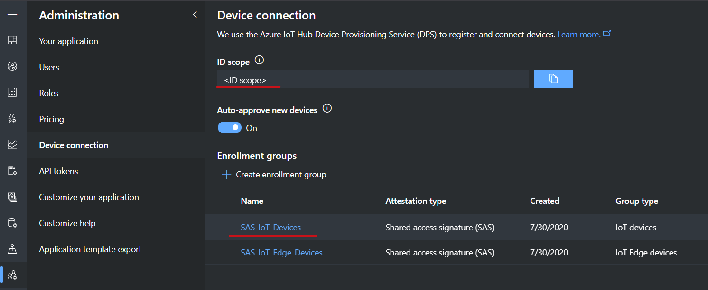

# IoT Central cloud to cloud integration
This repository contains a sample Azure Function that can be used to integrate device messages from
other IoT platforms into IoT Central using webhooks.

[](https://portal.azure.com/#create/Microsoft.Template/uri/https%3A%2F%2Fraw.githubusercontent.com%2FAzure%2Fiotc-cloud-to-cloud-integration%2Fmaster%2Fazuredeploy.json%3Ftoken%3DAnbfx1q6doAPwo3MSI8vqxTuJhM5cc-eks5byTiGwA%253D%253D)

## Instructions
The `Deploy to Azure` button above can be used to deploy this Azure Function in your subscription.
The following steps are needed for a successful deployment:

1. Set the `Scope Id` parameter as the value found in your IoT Central application
`Administration > Device Connection > Scope ID`

2. In `Iotc Sas Key`, enter the primary SAS key for you IoT Central app, found in
`Administration > Device Connection > Primary Key` (this key will be stored in a Key Vault
provisioned with the function).



3. After the deployment is done, install the NPM packages needed for the function to work. To do this,
go to the Function App that was deployed to your subscription `Functions > IoTCIntegration > Console tab`.
In the console, run the command `npm install` (this command might take several minutes to complete).


4. After the package installation finishes, the Function App needs to be restarted by clicking the
`Restart` button in `Overview` page.


5. The function is now ready to use. External systems can emit device data to an IoT Central device
by making a POST HTTP request to the function URL. The URL can be obtained in the newly created function App
`Functions > IoTCIntegration > Get function URL`.


The following sample shows the format of the POST body:

```
{
    "device": {
        "deviceId": "my-cloud-device"
    },
    "measurements": {
        "temp": 20.31,
        "pressure": 50,
        "humidity": 8.5
    }
}
```

NOTE: `deviceId` must be alphanumeric, lowercase, and may contain hyphens. The values of the fields
in `measurements` must be numbers (i.e., not quoted).

The device will be automatically created in IoT Central when the first message is received. It will
show up in your application under `Device Explorer > Unassociated devices`. Until the device is
associated to a template, HTTP calls to the function will return a 403 error status.


## What is being provisioned?
The template in this repository will provision a Storage Account, the Key Vault needed to store your
IoT Central key, an App Service Plan, and a Function App.

# Contributing

This project welcomes contributions and suggestions.  Most contributions require you to agree to a
Contributor License Agreement (CLA) declaring that you have the right to, and actually do, grant us
the rights to use your contribution. For details, visit https://cla.microsoft.com.

When you submit a pull request, a CLA-bot will automatically determine whether you need to provide
a CLA and decorate the PR appropriately (e.g., label, comment). Simply follow the instructions
provided by the bot. You will only need to do this once across all repos using our CLA.

This project has adopted the [Microsoft Open Source Code of Conduct](https://opensource.microsoft.com/codeofconduct/).
For more information see the [Code of Conduct FAQ](https://opensource.microsoft.com/codeofconduct/faq/) or
contact [opencode@microsoft.com](mailto:opencode@microsoft.com) with any additional questions or comments.
